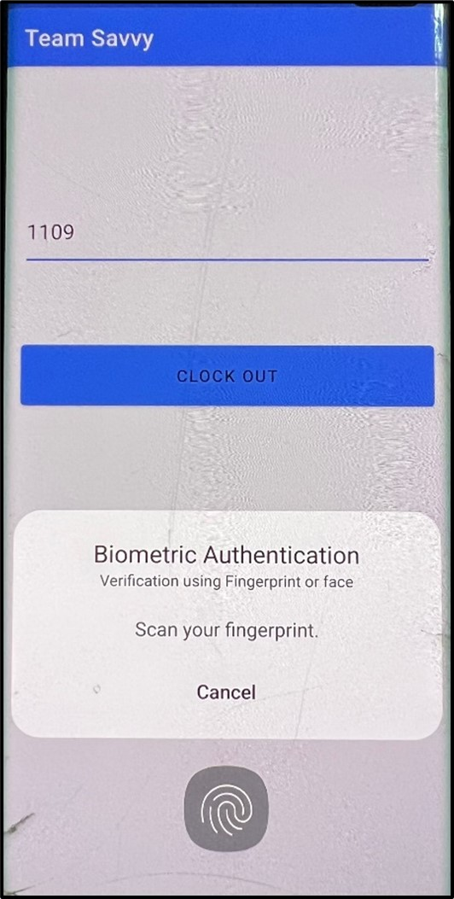
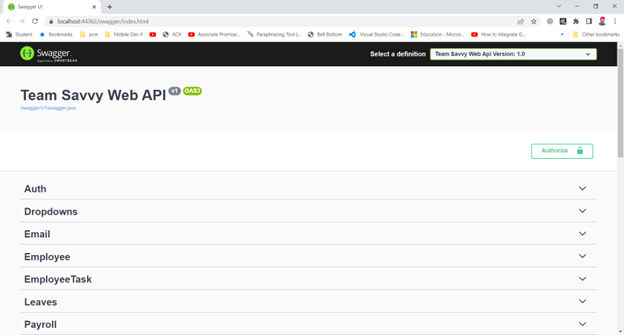
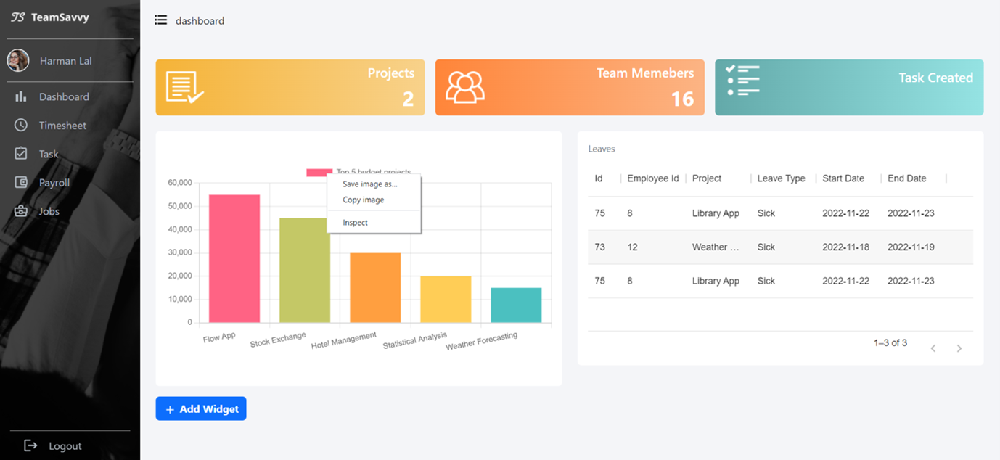
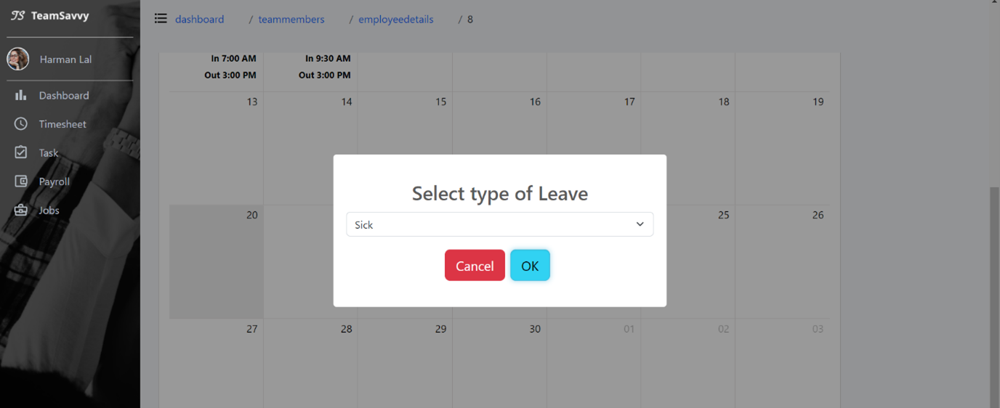
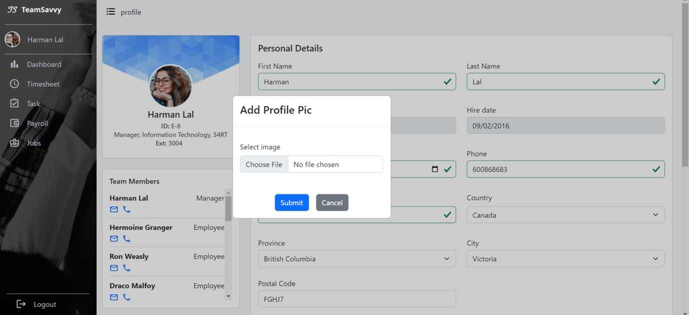

# TeamSavvy

Our objective is that an employee can access the details for projects, team members, timesheets, leaves and payroll information on one platform. The managers and HR can access the records of employees and also check the profile of the candidates who applied for jobs in their company, provide dashboard for analysis with system data. An improved user interface for a better user experience, to address this we have developed our application.

Teamsavvy is an application for an organization to provide different functionalities for employees with different roles. We have divided our project into useful functionalities based on roles(HR, manager, and employee).

## Table of Contents

- [Installation](#installation)
- [Usage](#usage)
- [Examples](#examples)

## Installation

To install and set up TeamSavvy, follow these steps:

1. Install Node.js latest version, Visual Studio/ Visual Studio Code and Android Studio
2. Install Entity framework nuGet package, Automapper nuGet package, and Swashbuckle.AspNetCore.Swagger for back-end
3. Clone the repository.
4. Install Bio meteric android application from repo

## Usage

To use TeamSavvy, follow these steps:

1. In the User `\your\path\Interface\teamsavvy` folder, open the folder in Visual Studio Code.
2. Open the terminal in current folder, run `npm start`
3. In `\your\path\RestFul Web API\TeamSavvy.Api` folder, open TeamSavvy.Api.sln file in Visual Studio
4. Press the play icon to run the back-end

## Examples

1. Landing screen for an employee, message for an employee for the attendance.

2. After entering the employee id the button will be activated.

3. The app will ask for biometric verification, if the fingerprint matches to the record of fingerprint in device the app will accept and allow user to clock-in or clock-out.

4. We have created API in .NET CORE using Entity Framework, LINQ, Automapper  and swagger documentation.

5. Dashboard is one of the main features of this application. It is the best tool for managers to handle project process, manage team members and do descriptive analysis using queries. 

6. The screen has leave indicators, in and out time of an employee which will be connected from mobile app to the web platform. Employee can apply for leaves and delete applied leaves.

7. The jobs page for employee have internal jobs created by HR and employee will not see the create job option. Employee can directly apply using Apply now button. HR will get the notification on their portal from where they can check the profile of an employee who applied.

8. HR can see all the projects in company and on click of view link, they can see project details which will have number of tasks created, completed and details of each task. Create project button is only for manager to create new project it will show popup for entering project details, end, start date and budget. 

9. The user profile page has employee information, which is consist of Personal details, Team members with their contact details, Skill set and add new skill option, bank details, and resign option. 
